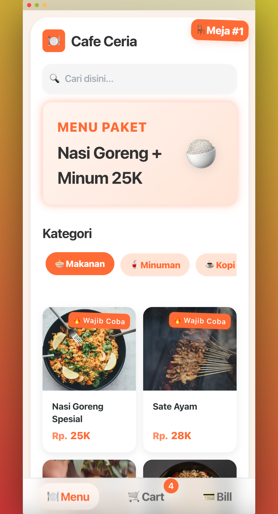
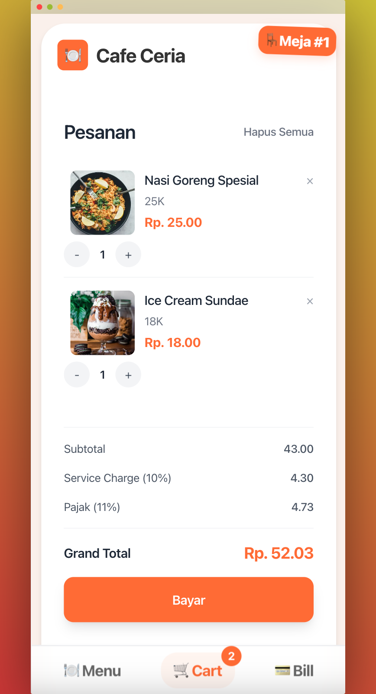
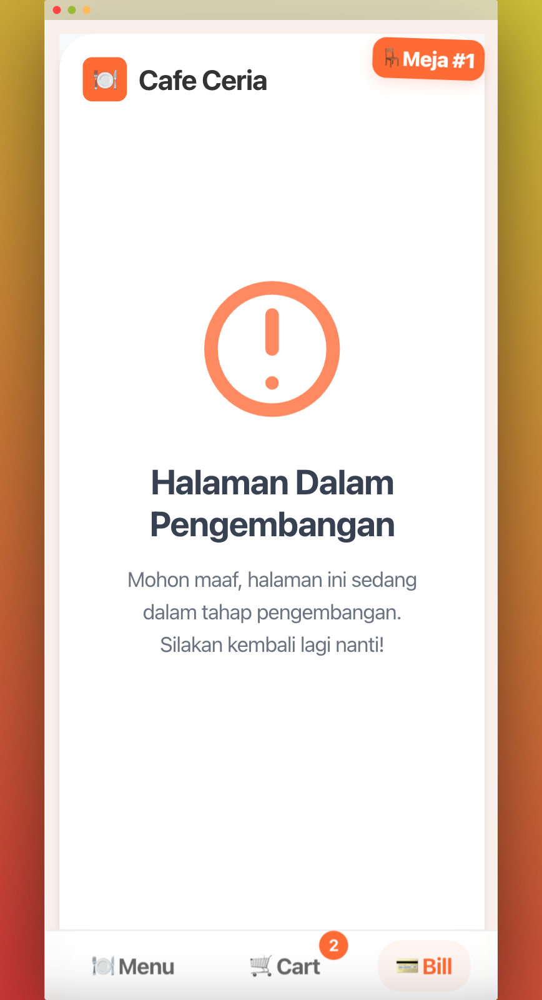

# E-Menu UI v2

Digital menu system built with Next.js with interactive menu browsing, cart management, and bill processing.

## Features

- 🍽️ **Interactive Menu**: Browse digital menu
- 🛒 **Cart Management**: Add/remove items with real-time quantity updates
- 💳 **Bill Processing**: View order summary and process payments (in development)
- 📱 **Responsive Design**: Optimized for both mobile and desktop views
- ⚡ **Fast Performance**: Built with Next.js for optimal loading speeds

## Screenshots

<div style="display: flex; justify-content: space-between; gap: 20px; margin: 20px 0;">
  <div style="flex: 1; text-align: center;">
    <p><strong>Menu View</strong></p>
    
  </div>
  <div style="flex: 1; text-align: center;">
    <p><strong>Cart Management</strong></p>
    
  </div>
  <div style="flex: 1; text-align: center;">
    <p><strong>Bill Processing</strong></p>
    
  </div>
</div>

## Technology Stack

- **Framework**: Next.js 15.1.6
- **UI Library**: React 19
- **Styling**: TailwindCSS
- **Language**: TypeScript
- **State Management**: Zustand
- **Animations**: Framer Motion

## Getting Started

### Prerequisites

- Node.js (LTS version recommended)
- npm or pnpm

### Installation

1. Clone the repository
```bash
git clone https://github.com/iqbaldp/emenu-v2-ui.git
cd emenu-v2
```

2. Install dependencies
```bash
pnpm install
```

3. Run the development server
```bash
pnpm dev
```

Open [http://localhost:3000](http://localhost:3000) with your browser to see the application.

## Project Structure

```
src/
├── app/              # Next.js app directory
├── components/       # Reusable UI components
├── config/          # Configuration files
├── data/            # Mock data and constants
├── store/           # State management
└── types/           # TypeScript type definitions
```

## Development

- `pnpm dev` - Start development server with turbopack
- `pnpm build` - Build for production
- `pnpm start` - Start production server
- `pnpm lint` - Run ESLint

## Contributing

Contributions are welcome! Please feel free to submit a Pull Request.
